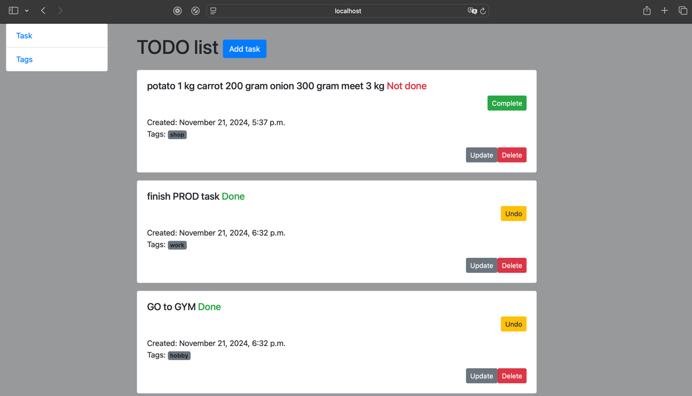
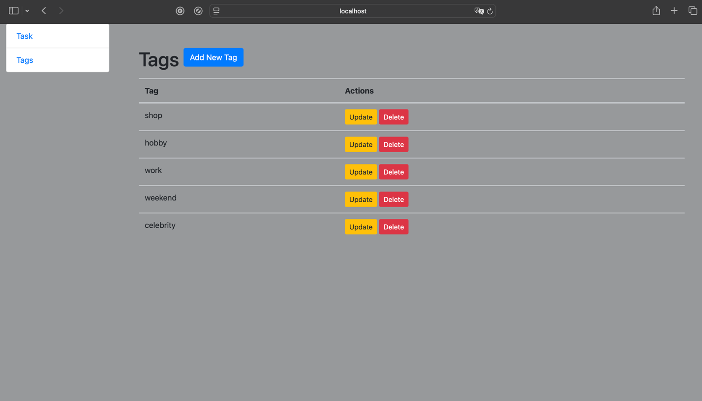

# TODO List Application

This is a simple TODO list application built with Django.

## Features

- Create, update, and delete tasks
- Mark tasks as complete or undo completion
- Tags management

### Task List Page


### Tag List Page


## Installation

1. Clone the repository:
   ```sh
   git clone https://github.com/Lev2098/todo-list.git
   ```

2. Navigate to the project directory:
   ```sh
   cd todo-list
   ```

3. Create a virtual environment and activate it:
   ```sh
   python -m venv .venv
   source .venv/bin/activate
   ```

4. Install the required dependencies:
   ```sh
   pip install -r requirements.txt
   ```

5. Run the development server:
   ```sh
   python manage.py runserver
   ```
